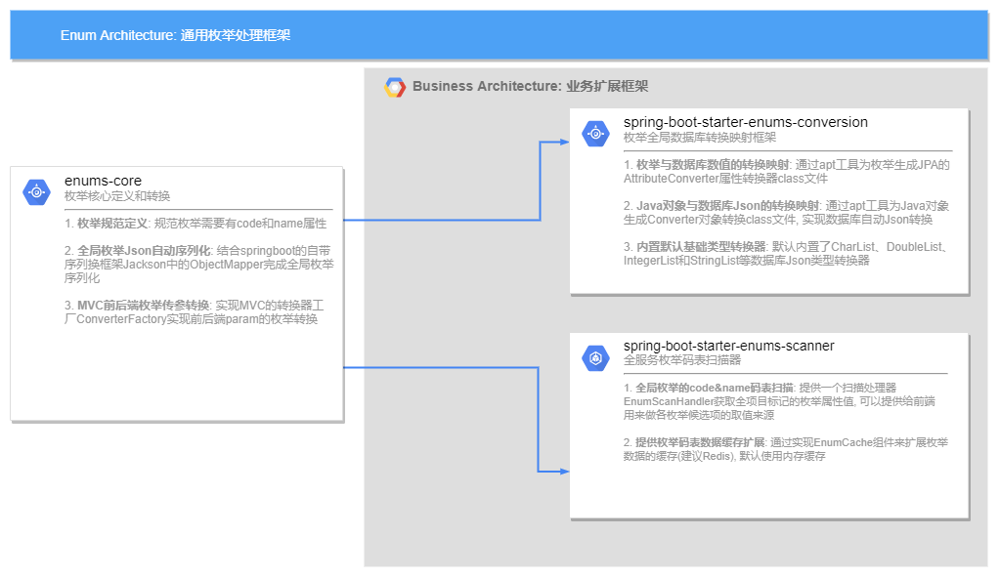

# enums-spring-boot-starter

[](LICENSE)
[](https://gitee.com/zc_oss/enums-spring-boot-starter)
[](https://gitee.com/zc_oss/enums-spring-boot-starter)

English | [简体中文](https://gitee.com/zc_oss/enums-spring-boot-starter/blob/master/README.MD)

enums-spring-boot-starter is an open-source project for Java enums that helps you automatically convert enums during database operations and interface parameter passing. By using this library, you can more easily use Java enums in different scenarios.
[toc]
## 主要特性
This general-purpose enum processor is divided into three sub-modules to implement different levels of enum functionality:
1. enums-core: Enum core definitions and conversions
  - Enum specification definition
  - Global Enum JSON automatic serialization
  - MVC front and back end enum parameter conversion
2. enums-conversion: Global database conversion mapping framework for enums
  - Enum-to-database numeric conversion mapping
  - Java object-to-database JSON conversion mapping
  - Built-in default basic type converter
3. enums-scanner: Full-service enum code table scanner
  - Global Enum code & name code table scanning
  - Provides enum code table data cache extension

[](架构图)


## Installation and Usage Guide
### I. Minimalist introduction (only requires front-end and back-end parameter passing enum conversion and JSON serialization)
In our project, if we only need to use some basic global enum processing functions, such as front-end and back-end parameter passing and getting data when automatically implementing enum-to-value conversion mapping, we only need the enums-core module part of this framework package.

#### Using Maven
Add the following dependency to your pom.xml file:
   ```xml 
   
   <dependency>
       <groupId>com.arkxos.framework</groupId>
       <artifactId>enums-core</artifactId>
       <version>1.1.8-RELEASE</version>
   </dependency>
   ```
#### Using Gradle
Add the following dependency to your build.gradle file: 
   ```groovy
   implementation 'io.gitee.zhucan123:enums-core:1.1.8-RELEASE'
   ```


### Usage

(Provide specific code examples in this section on how to use the library in the project)

#### Example

##### 1.Define our enum

```java

@Getter
@AllArgsConstructor
public enum OrderBillStateEnum implements ExtensionEnum {
    PENDING_AUDIT(1, "待审核"),
    PART_AUDIT(2, "部分审核通过"),
    NOT_PASS(3, "审核不通过"),
    UNCONFIRMED(5, "未确认"),
    UNDER_COMPLAINT(7, "申诉中"),
    CONFIRMED(9, "已确认");

    private final int code;
    private final String name;
    
}
```

##### 2.Front-end accept parameter enum (front-end only needs to pass code value)

如 http://localhost:8080/orders?billState=1

```java

@Data
public class PluginOrderBillQuery {

    @ApiModelProperty("账单审核状态")
    private OrderBillStateEnum billState;

}
```

##### 3.When the data DTO queried by the interface is returned to the front-end, the defined enumeration will be automatically converted to the code value

```java

@Data
public class PluginOrderBillDTO {

    @ApiModelProperty("账单id")
    private Long id;

    @ApiModelProperty("账单审核状态")
    private OrderBillStateEnum billState;
}
```
Sample response body structure
```json
{
  "success": 1,
  "message": "",
  "data": {
    "id": 1244,
    "billState": 1
  }
}
```


### II. Integrating Enum Mapping and JSON Mapping Conversion with the Database
If we need to use some basic features for global enum handling, such as automatically implementing enum-to-value mapping when passing parameters and obtaining data between the front-end and back-end, and automatically converting enums to the data's numeric types, we need to use the enums-conversion framework package (which includes the enums-core core framework).
#### Using Maven
Add the following dependency to your pom.xml file:
```xml

<dependency>
    <groupId>com.arkxos.framework</groupId>
    <artifactId>arkxos-framework-enum-starter-conversion</artifactId>
    <version>1.1.8-RELEASE</version>
</dependency>
```

#### Using Gradle
Add the following dependency to your build.gradle file:
```groovy
implementation 'io.gitee.zhucan123:spring-boot-starter-enums-conversion:1.1.8-RELEASE'
```
### Usage

(Provide specific code examples on how to use this library in your project in this section)


#### Example

##### 1. Define our enum

Note that we only need to add an additional @EnumAutoConverter annotation.


```java

@Getter
@AllArgsConstructor
@EnumAutoConverter
public enum OrderBillStateEnum implements ExtensionEnum {
    PENDING_AUDIT(1, "待审核"),
    PART_AUDIT(2, "部分审核通过"),
    NOT_PASS(3, "审核不通过"),
    UNCONFIRMED(5, "未确认"),
    UNDER_COMPLAINT(7, "申诉中"),
    CONFIRMED(9, "已确认");

    private final int code;
    private final String name;
    
}
```


### III. Full-service Enum Code Table Scanner
When we have numerous enum states in our service, we need to provide a global enum data scanner for the front-end to use as various option candidate values. This is where the enums-scanner comes in (which also includes the enums-core core framework).

#### Using Maven

Add the following dependency to your pom.xml file:

```xml

<dependency>
    <groupId>com.arkxos.framework</groupId>
    <artifactId>arkxos-framework-enums-starter-scanner</artifactId>
    <version>1.1.8-RELEASE</version>
</dependency>
```

#### Using Gradle


Add the following dependency to your build.gradle file:


```groovy
implementation 'io.gitee.zhucan123:spring-boot-starter-enums-scanner:1.1.8-RELEASE'
```

### Usage


(Provide specific code examples on how to use this library in your project in this section)


#### Example

##### 1. Define our enum

Note that we only need to add an additional @EnumScan annotation, which indicates the enums we need to scan.
```java

@Getter
@AllArgsConstructor
@EnumScan
public enum OrderBillStateEnum implements ExtensionEnum {
    PENDING_AUDIT(1, "待审核"),
    PART_AUDIT(2, "部分审核通过"),
    NOT_PASS(3, "审核不通过"),
    UNCONFIRMED(5, "未确认"),
    UNDER_COMPLAINT(7, "申诉中"),
    CONFIRMED(9, "已确认");

    private final int code;
    private final String name;
    
}
```

##### 2. Provide an API to obtain the entire project's enum data (through the EnumScanHandler processor, we can get the entire project's enum data)

```java
@RestController
@RequestMapping
public class EnumsController {

    @Resource
    private EnumScanHandler enumScanHandler;

    @GetMapping("/enums")
    public List<CodeTable> enums(){
        return enumScanHandler.codeTables();
    }
}

```
Example response body structure:
```json
[{
 	"enumName": "OrderBillStateEnum",
 	"items": [{
 		"code": 1,
 		"name": "待审核"
 	}, {
 		"code": 2,
 		"name": "部分审核通过"
 	}, {
 		"code": 3,
 		"name": "审核不通过"
 	}, {
        "code": 5,
      	"name": "未确认"
    }, {
      	"code": 7,
      	"name": "申诉中"
     }, {
      	"code": 9,
      	"name": "已确认"
     }],
 	"defaultItem": 1,
 	"classPath": "com.zhucan.management.infrastructure.constants.enums.OrderBillStateEnum"
 },{
	"enumName": "AbnormalHandleRoleEnum",
	"items": [{
		"code": 1,
		"name": "Scrum Master"
	}, {
		"code": 2,
		"name": "Product Owner"
	}, {
		"code": 3,
		"name": "Handler"
	}],
	"defaultItem": 1,
	"classPath": "com.zhucan.management.infrastructure.constants.enums.AbnormalHandleRoleEnum"
}, {
	"enumName": "AbnormalCauseTypeEnum",
	"items": [{
		"code": 1,
		"name": "需求分类错误"
	}, {
		"code": 2,
		"name": "租户名称未填写或格式不规范"
	}, {
		"code": 3,
		"name": "出库工时未填写"
	}, {
		"code": 4,
		"name": "出库工时为0，但未出库原因未填写"
	}, {
		"code": 5,
		"name": "需求评估工时不正确"
	}],
	"defaultItem": 1,
	"classPath": "com.zhucan.management.infrastructure.constants.enums.AbnormalCauseTypeEnum"
}]
```
## Contribution

We welcome all developers interested in this project to participate. Please read our contribution guide for more information.
## License

该项目根据 Apache License 2.0 许可进行授权。
This project is licensed under the Apache License 2.0.


> We hope this README template is helpful to you. You can further improve and optimize this README file based on the actual situation, ensuring that it contains all the necessary information for other developers to easily understand and use your project. Good luck!
  
  
  
  

